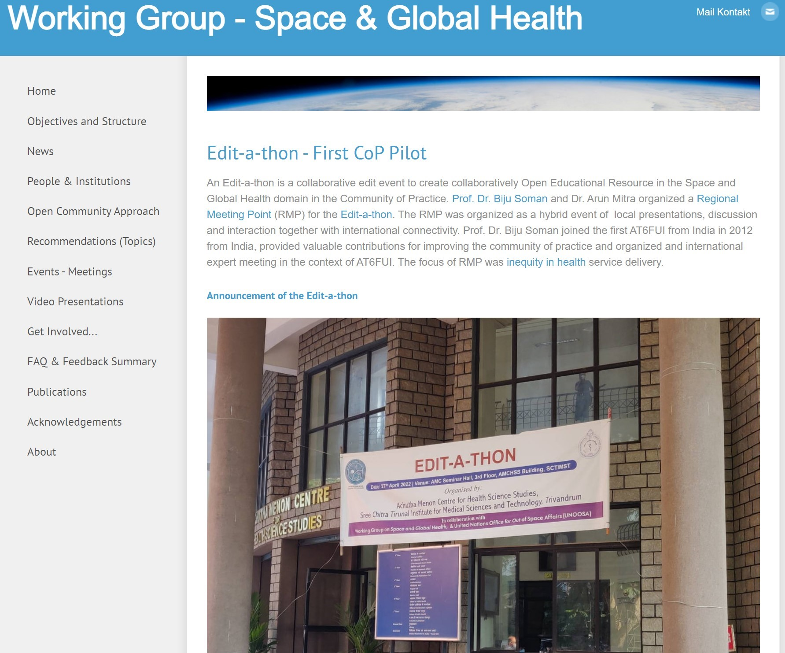

```{r message=FALSE, warning=FALSE, cache=FALSE, load_refs, echo=FALSE}
library(tidyverse)
library(here)
library(sf)
library(knitr)
library(plotly)
library(dygraphs)

library(xaringanExtra)
xaringanExtra::use_panelset()

library(RefManageR)
BibOptions(check.entries = FALSE, 
           bib.style = "authoryear", 
           cite.style = 'authoryear', 
           style = "markdown",
           hyperlink = FALSE, 
           dashed = FALSE)
myBib <- ReadBib("assets/example.bib", check = FALSE)

options(htmltools.dir.version = FALSE)
knitr::opts_chunk$set(warning = FALSE, message = FALSE)


top_icon = function(x) {
  icons::icon_style(
    icons::fontawesome(x),
    position = "fixed", top = 10, right = 10
  )
}

captions <- c('2011', '2012', '2013','2014', '2015', '2016', '2017', '2018', '2019')

```

&nbsp;


# .black[.large[.font100[.bold[Data Science for Public Health]]]]

## .black[.large[.bold[Experiences from AMCHSS]]]

#### .black[.large[.bold[`r Sys.Date()`]]]

&nbsp;

.bottom[
.pull-right[
.black[.font150[.bold[Dr. Arun Mitra, ]]]
.black[.large[PhD Scholar, AMCHSS]]
<br/>
.black[.font110[.code[`arunmitra@sctimst.ac.in`]]]
]
]


---
class: slide-with-logo, middle

# About SCTIMST, Trivandrum

###   Institution of National Importance with the status of a University in 1980 under the Department of Science and Technology, Govt. of India by an Act of Parliament (Act 52 of 1980).

### The institute has the status of a university and offers excellent research and training facilities. 

---
class:  middle

.pull-left-1[
### .bold[One of the unique institutions in the country.]
----
### .bold[It has three wings]
----

### .bold[Academics:]
+ Diploma programs
+ MD & MPH program
+ PhD program 
+ Post Doctoral Fellowships
<br/>

]

.pull-right-2[


]

---

# AMCHSS, SCTIMST, Trivandrum

<br/>

### Offers Masters level courses and Ph.D.
- MPH and PhD also offered in collaboration with National Institute of Epidemiology, Chennai and Christian Medical College, Vellore.

### Regional Center for Health Technology Assessment
- Established under the Department of Health Research (DHR), MoHFW, Govt of India.

### Advanced Center for Clinical Trials
- Established under the Indian Council for Medical Research (ICMR)

---

# Activities at AMCHSS
- Research Collaborations with various National and International Universities, Public Health Agencies, and Governments
- Community Participation
- Empowering Tribal (ST) Communities

.pull-left-2[

]

.pull-right-1[
- Some of the areas of work:
  + Non-Communicable Disease
  + Health Policy
  + Health Equity
  + Gender
  + Health Economics
  + Public Health Informatics
]

---

# Field Practice Area: <br/> .bold[Athiyannoor Sree Chitra Action (ASA)]

<br/>

.pull-left-2[

]

.pull-right-1[
- Households Mapped: >35,000
- Population Covered: ~2 lakh 
- Across ~60 sq km 
- 6 Grama Panchayats
- Participatory GIS 
]

<br/>

.pull-right-2[

.small[.font50[
Support from: Center for Earth Sciences (CESS), Health Information System Project - India (HISP-India), Universrity of Oslo, Norway, National Health Systems Resource Center (NHSRC), New Delhi, Capacity Development for Decentralization in Kerala (CapDecK)
]]]
---

# Data Science at AMCHSS

.small[.font70[
- Research Work
  + Rising Caesarean Sections in India: NFHS Data
  + Built environment and non-communicable diseases
  + Dengue in Punjab
  + Interstate Migration in Kerala
  + AMCHSS COVID-19 Dashboard
- Collaborations
  + `Edit-a-thon` with UNOOSA, University of Koblenz & Landau, Germany
  + Access to stroke facilities in India with University of Florida and University of Chicago
  + Health Equity Research with University of Oslo, Norway
  + Course Development: Asian Context - DMgtAsia, with DIKU & University of Oslo, Norway
- Capacity Building and Training Activities
  + RIntro Workshop Series
  + In-dialogue with Govt of Andhra Pradesh
- Other Related Work
 + Health Technology Assessment
 + Systematic Reviews
 
]]

---

class: middle

# Rising Cesarean Sections in India

- Many socio-demographic factors have been attributed to the rise in caesarean sections. But, systematic evidence is still lacking.
- Publicly available data from large scale national surveys has the potential to offer much needed insights. 
- When combined with geo-spatial methodology has the potential to help uncover the hidden inequities in maternal healthcare.
- Generate evidence and aid in informed decision-making in health policy.

### Objectives

1. To study the patterns of caesarean section at the state and district level. 
2. To investigate spatial clustering of caesarean sections across districts.

---

# Data Sources

<br/>

.pull-left[
### The National Family Health Survey (NFHS)
.small[.font70[
  - NFHS-4 (2015-16) & NFHS-5 (2019-21)
  - District Level Fact Sheets
  - `*.pdf` format
  - `>`100 indicators on Maternal & Child Health
]]]

.pull-right[
### Health Management Information System (HMIS)
.small[.font70[
  - Longitudinal data (2011 - 2019)
  - Facility level data
  - Monthly reports
  - `*.xls` and `*.csv` 
]]]

<br/>

Traditional approaches may not be ideal considering the volume and diversity of the data.

<br/>

.right[
### $\longrightarrow$ &nbsp; &nbsp; &nbsp; Data Science Approach 
]
---
### Data Preparation
.left-column[


### Three Steps
.small[
.font80[
1. Web Scraping
 
2. Data Extraction

3. Preparation 
  - Cleaning
  - Wrangling
  - Linkage

<br/>


- Reproducible
- Open Source
- Peer Reviewed
]
]

]

.right-column[

]

<br/>
<br/>

.right[
### .red[Cleaned] $\longrightarrow$ .red[Exported] $\longrightarrow$ .red[Exploratory Data Analysis] 
]

---
# Data Analysis & Visualization


.left-column[
.small[

### Exploratory Data Analysis  

.font60[

- Data Summaries 
- Zonal Statistics

]

### Spatial Analysis

.font60[
- Clustering <br>.footnotesize[(Global & Local Moran's I)]
- Hot Spots  <br>.footnotesize[(Getis Ord Gi*)]

]
]
]

.right-column[


]
---
# Results

### Proportion of births by caesarean: <br/> 17.2% in 2015-16 $\longrightarrow$ 21.5% in 2019-21. 
#### Higher increase in rural areas as compared to urban.
#### More in private facilities as compared to public facilites.

.center[

]

---
# Trends & Patterns of CS in India
.left-column[ 

.font60[
### Increasing Trends

- National
- State
- District

### Varying patterns 

- Between States 
- Within States

]
]

.right-column[


]


.right[.footnote[.red[.bold[Data Source:]] Based on HMIS data from 2011-2019. Available at .bold[`https://data.gov.in`]]]

---


## Spatial Analysis

.pull-left-2[


<style type="text/css">
.tg  {border-collapse:collapse;border-color:#93a1a1;border-spacing:0;}
.tg td{background-color:#fdf6e3;border-bottom-width:1px;border-color:#93a1a1;border-style:solid;border-top-width:1px;
  border-width:0px;color:#002b36;font-family:Arial, sans-serif;font-size:14px;overflow:hidden;padding:10px 5px;
  word-break:normal;}
.tg th{background-color:#657b83;border-bottom-width:1px;border-color:#93a1a1;border-style:solid;border-top-width:1px;
  border-width:0px;color:#fdf6e3;font-family:Arial, sans-serif;font-size:14px;font-weight:normal;overflow:hidden;
  padding:10px 5px;word-break:normal;}
.tg .tg-cly1{text-align:left;vertical-align:middle;font-size:10px}
.tg .tg-0lax{text-align:left;vertical-align:top}
.tg .tg-d54t{background-color:#eee8d5;text-align:left;vertical-align:middle;font-size:10px}
</style>
<table class="tg">
<thead>
  <tr>
    <th class="tg-0lax">Parameter</th>
    <th class="tg-0lax">Facility</th>
    <th class="tg-0lax">NFHS</th>
    <th class="tg-0lax">G Statistic</th>
    <th class="tg-0lax">Z Score</th>
    <th class="tg-0lax">P Value</th>
  </tr>
</thead>
<tbody>
  <tr>
    <td class="tg-d54t" rowspan="4">Institutional Delivery</td>
    <td class="tg-d54t" rowspan="2">Overall</td>
    <td class="tg-d54t">NFHS-4</td>
    <td class="tg-d54t">0.00776</td>
    <td class="tg-d54t">6.80576</td>
    <td class="tg-d54t">&lt;0.0001</td>
  </tr>
  <tr>
    <td class="tg-cly1">NFHS-5</td>
    <td class="tg-cly1">0.00762</td>
    <td class="tg-cly1">4.62108</td>
    <td class="tg-cly1">&lt;0.0001</td>
  </tr>
  <tr>
    <td class="tg-d54t" rowspan="2">Public</td>
    <td class="tg-d54t">NFHS-4</td>
    <td class="tg-d54t">0.00799</td>
    <td class="tg-d54t">9.03936</td>
    <td class="tg-d54t">&lt;0.0001</td>
  </tr>
  <tr>
    <td class="tg-cly1">NFHS-5</td>
    <td class="tg-cly1">0.00784</td>
    <td class="tg-cly1">7.76971</td>
    <td class="tg-cly1">&lt;0.0001</td>
  </tr>
  <tr>
    <td class="tg-d54t" rowspan="6">Caesarean Sections</td>
    <td class="tg-d54t" rowspan="2">Overall</td>
    <td class="tg-d54t">NFHS-4</td>
    <td class="tg-d54t">0.01099</td>
    <td class="tg-d54t">18.67214<br></td>
    <td class="tg-d54t">&lt;0.0001</td>
  </tr>
  <tr>
    <td class="tg-cly1">NFHS-5</td>
    <td class="tg-cly1">0.01081</td>
    <td class="tg-cly1">19.13736</td>
    <td class="tg-cly1">&lt;0.0001</td>
  </tr>
  <tr>
    <td class="tg-d54t" rowspan="2">Public</td>
    <td class="tg-d54t">NFHS-4</td>
    <td class="tg-d54t">0.00810</td>
    <td class="tg-d54t">8.28497</td>
    <td class="tg-d54t">&lt;0.0001</td>
  </tr>
  <tr>
    <td class="tg-cly1">NFHS-5</td>
    <td class="tg-cly1">0.00808</td>
    <td class="tg-cly1">9.00839</td>
    <td class="tg-cly1">&lt;0.0001</td>
  </tr>
  <tr>
    <td class="tg-d54t" rowspan="2">Private<br></td>
    <td class="tg-d54t">NFHS-4</td>
    <td class="tg-d54t">0.01082</td>
    <td class="tg-d54t">19.18451</td>
    <td class="tg-d54t">&lt;0.0001</td>
  </tr>
  <tr>
    <td class="tg-0lax">NFHS-5</td>
    <td class="tg-0lax">0.00749</td>
    <td class="tg-0lax">17.28355</td>
    <td class="tg-0lax">&lt;0.0001</td>
  </tr>
</tbody>
</table>


<br/><br/>
.bold[Evidence of spatial clustering]

Moran’s I (Global):  p-value < 0.01 <br/>
Getis-Ord General G (Local): p-value < 0.01
]


.pull-right-1[


Optimised Hot Spot Analysis <br> 

NFHS-5 (2019-21)
]
---
### .large[Hot Spot Analysis:] Public vs Private Facilities

.pull-left-5[
Public Hospitals - NFHS-5 (2019-2021)]

.pull-right-5[
Private Hospitals - NFHS-5 (2019-2021)]


---
class: middle

### Trends across Time: HMIS Data (2011-2019)
.pull-left-1[

.code40[

````r
plot_fn <- function(x){
  
  cs_hotspot_analysis <- arc.open(filepath)
  
  cs_hotspot_analysis_data <- arc.select(cs_hotspot_analysis)
  
  cs_hotspot_analysis_sf <- arc.data2sf(cs_hotspot_analysis_data)
  
  cs_hotspot_analysis_sf %>% 
    ggplot() + 
    geom_sf(aes(fill = GiZScore, color = GiZScore)) + 
    scale_fill_viridis_c() +
    scale_color_viridis_c()
}


plots <- 2011:2019 %>% map(plot_fn)
````

]

]

.pull-right-2[


]


---
# Built Environment and Non-Communicable Disease

<br/>
<br/>

### Objectives

1. To study the distribution of built environment variables in Kerala
2. To find spatial clusters of diabetes and physical inactivity among sample population in Kerala and to evaluate built environment characteristics within clusters of high and low rates.
3. To determine the relationship between built environment variables in the neighborhood and prevalence of NCDs among sample population in Kerala

---


---

### Landsat-8 & SRTM

.center[


]
---
# Identification of Diabetic clusters among urban study sites

<br/>


---

# Studying Interstate in-migration towards Kerala

.pull-left-1[

]

.pull-right-2[

]

.pull-right-2[
.small[.font50[
Census data on migration is compromised by the definitions used but still provides a comprehensive description of the volume and patterns of migration. These patterns provide much needed insights for designing and implementing migrant inclusive welfare policies at the state level. 

]]
]

---

# Modelling incidence of Dengue in Punjab

.pull-left-1[
.small[
- Data Science Approach
- RHIS Data
- Reproducible Framework
]

]

.pull-right-2[
.center[

]
]

---
# AMCHSS COVID-19 Dashboard


---

# AMCHSS COVID-19 Dashboard


---


# AMCHSS COVID-19 Dashboard
.panelset[


.panel[.panel-name[Epicurves]

.center[
```{r echo=FALSE, out.width= "100%"}
plots <- read_rds(here::here("plots","state_district_epidemic_curves_dygraphs.rds"))

plots[[1]]
```
]
]

.panel[.panel-name[GR]

.center[
```{r echo=FALSE, out.width= "100%"}
plots <- read_rds(here::here("plots","growth_rate_w2_plot.rds"))

plots
```
]
]

.panel[.panel-name[DT]

.center[
```{r echo=FALSE, out.width= "100%"}
plots <- read_rds(here::here("plots","doubling_time_w2_plot.rds"))

plots
```
]
]


.panel[.panel-name[Rt]

.center[
```{r echo=FALSE, out.width= "100%"}
plots <- read_rds(here::here("plots","r0_districts_plot.rds"))

plots
```
]
]


.panel[.panel-name[SIR]

.center[
```{r echo=FALSE, out.width= "100%"}
plots <- read_rds(here::here("plots","SIR_plot.rds"))

plots
```
]
]

.panel[.panel-name[SMR]

.center[
```{r echo=FALSE, out.width= "100%"}
plots <- read_rds(here::here("plots","SMR_plot.rds"))

plots
```
]
]

.panel[.panel-name[Mobility]

.center[
```{r echo=FALSE, out.width= "100%"}
include_graphics(here::here("img","population_mobility.JPG")) 
```
]
]


]
---


# Semi-automated Report Generation
.panelset[

.panel[.panel-name[Dynamic Reports]

```{css echo=FALSE}
.pull-left {
  float: left;
  width: 33%;
}
.pull-right {
  float: right;
  width: 67%;
}
.pull-right ~ p {
  clear: both;
}
```
    
.pull-left[
```{r}
# Specify the State 
state = "Kerala"

# Specify the District 
district = "Wayanad"
```
]

.pull-right[
```{r echo=FALSE, out.width= "100%"}
include_graphics(here::here("img", "ICMR_Proposal_Dashboard", "12.JPG")) 
```
]
]


.panel[.panel-name[Comparison with other Districts]

.center[
```{r echo=FALSE, out.width= "75%"}
include_graphics(here::here("img", "ICMR_Proposal_Dashboard", "9.JPG")) 
```
]
]


.panel[.panel-name[Patterns]

.center[
```{r echo=FALSE, out.width= "85%"}
include_graphics(here::here("img", "ICMR_Proposal_Dashboard", "11.JPG")) 
```
]
]

]
---
class: middle

# Research Collaborations at AMCHSS

<br/>

.small[.font70[
- Collaborations
  + `Edit-a-thon` with UNOOSA, University of Koblenz & Landau, Germany
  + Access to stroke facilities in India with University of Florida and University of Chicago
  + Health Equity Research with University of Oslo, Norway
  + Course Development: Asian Context - DMgtAsia, with DIKU & University of Oslo, Norway
- Capacity Building and Training Activities
  + RIntro Workshop Series
  + In-dialogue with Govt of Andhra Pradesh
- Other Related Work
 + Health Technology Assessment
 + Systematic Reviews
 
]]

---

.pull-left-1[
# `Edit-a-thon`

- Regional Meeting Point
- CoP Pilot 
- Open Educational Resources (OER)

.center[


<br/>


]
]

.pull-right-2[

]
---
# Mapping access to Stroke Centers in India
.center[

]


---
# Distribution of Stroke Centers in India
.center[

]

---
# Access to Stroke Centers in India
.center[

]

---
# Mapping access to Stroke Centers in India
.center[

]


---
# Area covered within the Golden Hour in Kerala

<br/>

.pull-left-5[


]


.pull-right-5[


]
---
# Travel times to Stroke Centers in KL, KA, TN

<br/>

.pull-left-5[

]

.pull-right-5[

]
---

# Travel times to Stroke Centers in South Indian States

<br/>

.pull-left-5[

]


.pull-left-5[

]

---
# Collaborations with IFI, UiO, Norway

.small[.font70[

- Health Equity Research with University of Oslo, Norway

- Course Development: Asian Context - DMgtAsia, with DIKU & University of Oslo, Norway
]]

<br/>

# Capacity Building and Training Activities at AMCHSS


.small[.font70[
- Capacity Building and Training Activities
  + `RIntro` Workshop Series
  + In-dialogue with Govt of Andhra Pradesh
- Other Related Work
 + Health Technology Assessment
 + Systematic Reviews
 
]]
---

# `RIntro` Workshop Series
<br/>
.pull-left-2[
### Three Cohorts: 2 in 2021, 1 in 2022
### Over 50 Health Professionals across the country
]

.pull-right-1[

]

.pull-left-2[
- World Health Organization, India Office
- Centre for Disease Control, US Embassy
- National Institute of Epidemiology, Chennai
- Armed Forces Medical College, Pune
- All India Institute of Medical Sciences - New Delhi, Bhopal, Raipur, Jhodpur
]


### `https://amchss.github.io/RIntro2022/`


---
class: sydney-blue
background-image: url(assets/sctimst_logo_white.png)
background-size: 150px
background-position: 5% 95%

# .Large[Thanks!]

.pull-right[.pull-down[

<a href="https://amchss-sctimst.shinyapps.io/covid_dashboard">
.white[`r icons::fontawesome("link")` amchss-sctimst.shinyapps.io/covid_dashboard]
</a>

<a href="https://amchss.github.io/RIntro2022">
.white[`r icons::fontawesome("link")` amchss.github.io/RIntro2022]
</a>

<a href="http://github.com/amchss">
.white[`r icons::fontawesome("github")` @amchss]
</a>

<br><br><br>

]]
